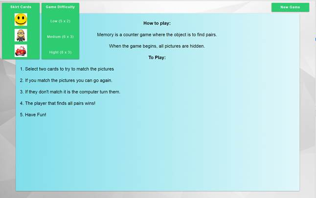
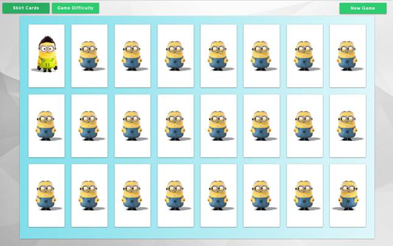
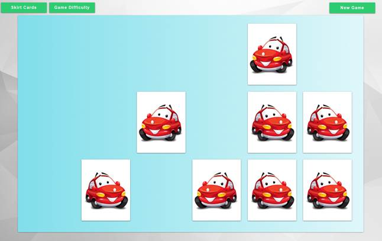

## Match-Match Game 

### Common requirements:

- create a github repo with the name of app;
- implement an app locally, make commits on every feature you do (commit names should describe your action add button component, create app store and so on), push it to the origin, add me as reviewer at least 2 days before diploma presentaton.

#### Additional points:

- use React;
- use Webpack 4 for bundling your project;
- use Redux for storing your data;
- use React-Router for routing in your app.

### Requirements:

- upon entering the game, the user sees a greeting and short rules of the game;
- next fills in the player's profile:
    - first Name;
    - last Name;
    - email.
- the player can choose:
    - type of card backs;
    - number of cards (difficulty of the game).
- after the start, a timer starts working, which counts down the time from the start of the games;
- by clicking on a card - it turns over smoothly, matching cards disappear just as smoothly, if a pair does not match - both cards are turned face down;
- at the end of the game - congratulations to the player;
- the distribution of cards is always random;
- the application maintains a table of records - TOP10 results;
- the high score table and player profile are stored in window.localStorage.
 
 
An example of an interface, your design may be different:

